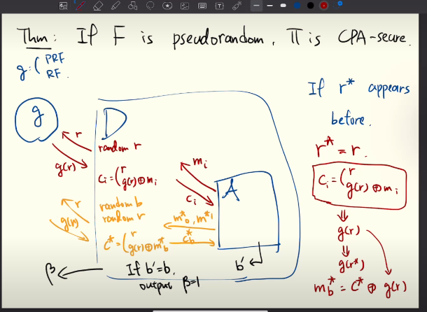
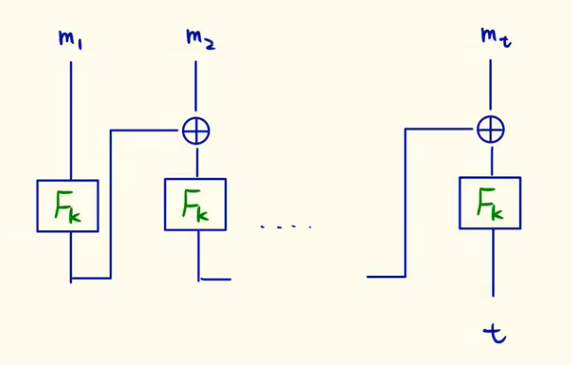
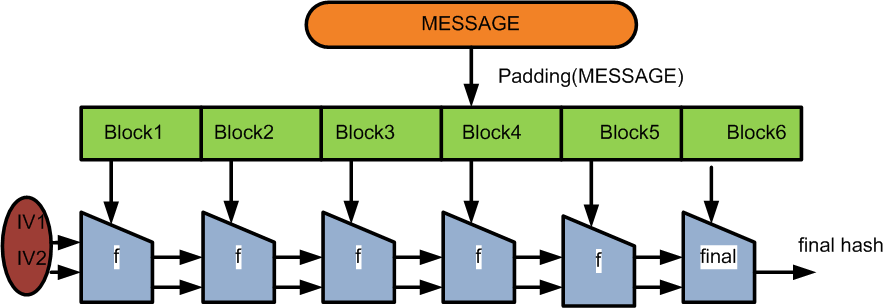
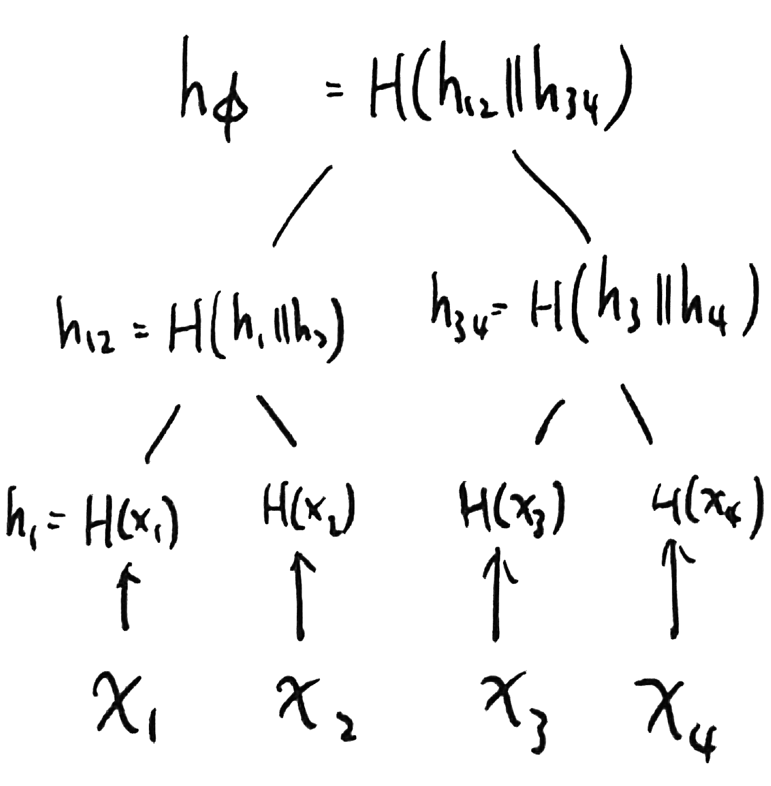

<!--Hackmd theme-->


# 密碼學筆記

[TOC]

## Introduction

* This document  represents the note of cryptography class in NTUT.
* 老師的課程筆記連結如下: [1121_Cryptography](https://hackmd.io/@wycchen/1121_Crypto)

### Grade

1. 50%: 小考
2. 50%: project present

### 課前準備

1. 帶至少一張A4紙for小考

### 上課地點

* [國立臺北科技大學先鋒國際研發大樓](https://maps.app.goo.gl/NqST4E8dDn32UQWA8)501

### Schedule

1. 9 (or 10) weeks for lectures
2. 8 (or 7) weeks for project presentation
    * 一組2人
    * 組別及成員會由老師進行分派

## 第一堂課

### Introduction

1. Why cryptograhpic is security?
    1. Background: [Reduction](https://en.wikipedia.org/wiki/Reduction_(complexity))
    2. Main idea: if there isn't any well-known solution for problem Q？
        * $\pi$: **Cryptographic scheme**
        * A: **Well-studied Problem**
        * Could we do the following thing?
          > Reduction from **A (well-studied problem)** into **$\pi$ (Cryptographic scheme)**
        * If $\pi$ is broken by A, then Q can be solved.
          => ++If $\pi$ can't broken by A, then $\pi$ is secure.++
    3. If ther is a good algorithm for Q,then there exists a good one for another well-known problem Q~
2. [Kerckoff's Principle](https://zh.wikipedia.org/zh-tw/柯克霍夫原則)
        1. Security only relies on ++the secret of **key**++.
        2. The method must not be required **secret**.
   
3. Principle of modren crypto
    1. Formal Definition
        1. System Framework
        2. Security Definition
    2. Precise Assumption
    3. Construction
    4. Security Proof

### Formal Definition

#### System Framework

1. What's the definition of encryption?
    * There are total 3 algo for encryption
        1. generate key
        2. encryption
        3. decryption
    * Flow
      
        1. $Gen(λ) \rightarrow k$
        2. $Enc(k,m) \rightarrow c$
        3. $Dec(k,c) := m$
            * deterministic (確定性)
            * 強調m要是原本的那個m (in 2.)，不是其他m

#### Security Definition

(TODO)

### Precise Assumption

* No, shift cipher沒有使用任何前提假設
  所以它可以在任何地方使用、都會成立

### Construction

1. Space
    1. key space
    2. cipher text space
    3. message space
2. Take [Shift Cipher](https://zh.wikipedia.org/zh-tw/替换式密码) as an example.
    1. For $gen(λ) \rightarrow k$
       $k \in \alpha =  \{0, 1, ..., 25\}$
        * uniformly choose $k \in \alpha$
    2. For $Enc(k,m) \rightarrow c \in C = \{a, ..., z\}$
        * $c = (m + k) mod 26$
    3. For $Dec(k,c) := m$

### Security Proof

1. How to prove it's secure? 
   [Perfect Secrecy](https://zh.wikipedia.org/zh-tw/完善保密性): $Pr[M=m|C=c] = Pr[M=m]$
    1. $Pr[A(c) \rightarrow m] = \frac{1}{26}$
       
       $Pr[M=m|C=c]$
       M := variable, which is A's output
       m := original message
       C := A has input C (encrypted message)
       c := original encrypted message
    2. $Pr[M=m]$
       $Pr[A() \rightarrow m] = \frac{1}{26}$
    3. 若 ++什麼都沒有++ 與 ++只有c沒有k++ 猜中明文的機率相同
       $\Rightarrow$ 此加密演算法具有[Perfect Secrecy](https://zh.wikipedia.org/zh-tw/完善保密性)
2. For example
    * Question
        * $m='a'$
        * $c='b'$
        * $Pr[M='a']=0.7$
        * $Pr[M='z']=0.3$
    * Known
        * $Pr[C='b']=\frac{1}{size(cipher-text-space)}=\frac{1}{26}$
    * Prove
        * $Pr[M='a' | C='b'] = Pr[M='a']$
            * $Pr[M='a' | C='b'] = 0.7$
                * 套用[Bayes' theorem](https://zh.wikipedia.org/zh-tw/贝叶斯定理)
                  $\Rightarrow Pr[M='a' | C='b'] = \frac{Pr[C='b'|M='a']Pr[M='a']}{Pr[C='b']} = \frac{\frac{1}{26} * 0.7}{\frac{1}{26}} = 0.7$
                    * Why $Pr[C='b']=\frac{1}{26}$?
                      $Pr[C='b']=\frac{1}{size(cipher-text-space)}=\frac{1}{26}$
                    * Why $Pr[M='a' | C='b']=\frac{1}{26}$?
                      (TODO)since if M = 'a', C = 'b' only occus k = 1
                      Known $\Bigl\{
                      \begin{aligned}
                      Pr[M='a']=0.7
                      \end{aligned}$
                      $\Rightarrow Pr[C='b'|M='a']=\frac{1}{26}$
                      Known $Pr[M='z']=0.3$
            * $Pr[M='a']=0.7$
        * $\because Pr[M='a' | C='b'] = Pr[M='a'] = 0.7$
          $\therefore$ [Shift cipher](https://zh.wikipedia.org/zh-tw/替换式密码) has [perfect secrecy](https://zh.wikipedia.org/zh-tw/完善保密性).

### 下一次的小考內容

1. [上面Security Proof](#Security-Proof) for example的證明
2. the disadventage of [shift cipher](https://zh.wikipedia.org/zh-tw/替换式密码)
    1. limited key space & cipher text space -> vulnerable to a brute force attack
    2. vulnerable to a [known plaintext attack](https://zh.wikipedia.org/zh-tw/已知明文攻击).
        * if attacker knows limited parts of plaintest (message), it is cracked.

### References

1. [Caesar Cipher in Cryptography](https://www.geeksforgeeks.org/caesar-cipher-in-cryptography/)
2. [Caesar, Shift the Cipher](https://www.codingninjas.com/studio/library/caesar-shift-the-cipher)
3. [Caesar cipher – pros and cons](https://cryptomath.wordpress.com/2008/08/18/caesar-cipher-pros-and-cons/)

## 第二堂課

### Perfect Secrecy Definitions

* 符合3個裡面任何一個3個definition $\Rightarrow$ 3個definitions都符合

1. PS1 ([Perfect secrecy](https://zh.wikipedia.org/zh-tw/完善保密性) definition 1): [第一堂課提到的定義證明](#Security-Proof)
2. PS2 ([Perfect secrecy](https://zh.wikipedia.org/zh-tw/完善保密性) definition 2): $Pr[Enc_k(m_1)=c]=Pr[Enc_k(m_2)=c]$
    * 加密後產生的文字機率分布完全隨機
    * fix a ciphertext
3. PS3 ([Perfect secrecy](https://zh.wikipedia.org/zh-tw/完善保密性) definition 3):
   Consider the challenger

   
    * $b \in \{0, 1\}$
    * $c \leftarrow Enc(k, m_b)$
    * $b' \leftarrow \{0, 1\}$
    * A wins the game iff b'=b
    * $Pr[PrivK(n)=1]=\frac{1}{2}$
        * $n$ is [security parameter](https://en.wikipedia.org/wiki/Security_parameter)

### One-time pad

* For this example, we use XOR to construct generate key algo.

#### Formal Definition
##### System Framework

* Fix $l>0$, $|M|=|C|=|K|=l$
* $Gen(l) \rightarrow k$
* $Enc(k, m) \rightarrow C$ by $C = K \oplus M$
* $Dec(k, c) \rightarrow M$ by $M= K \oplus C$

##### Security Definition

* message space: $2^l$
* ciphertext space: $2^l$
* key space: $2^l$

#### Precise Assumption

#### Construction

#### Security Proof

### Limitation of Perfect Secrecy: key space size needs to greater than message space size

* If $\pi = (Gen, Enc, Dec)$ is a perfectly secret encryption scheme with message space $m$ and key space $k$.
* $|k| \ge |m|$

#### Proof

* Suppose $|k| < |m|$, $\pi$ cannot be PS.
* 假設M呈常態分佈
    Fix $c \in C$, $Pr[c=C]=0$
* $C + k_1 \rightarrow m_1$
  $C + k_2 \rightarrow m_2$
  ...
  $C + k_{|M|} \rightarrow m_{|M|}$
* $\Rightarrow M(C)$ with data loss because $|k| < |m|$
* $\because m' \neq (origin) m$
  $\therefore Pr[M=m'|C=c]=0$
  $\Rightarrow Pr[M=m'|C=c]=0 \neq Pr[M=m]$

#### Secure Channel

1. Use secure channel to deliver key.
2. Why not just use secure channel to deliver message?
   $|k|$ needs to $\ge |m|$

#### Hope
1. $|k|$ needs to $\ge |m|$
    * But we hope $|k| < |m|$
2. One time pad is one-time.
    * But we hope one key can be used for many times.

### Computational Security

* target: adversaries cann't get the message in $\forall$ probabilistic polynomial time (PPT)
    * deterministic vs probabilistic
        * deterministic: 100% specific complexity (e.g. 100% $O(2^n)$)
        * probabilistic: maybe random complexity (e.g. 70% $O(n^{100})$)
    * $\forall$ PPT adversaries A
        * Pr[A wins] = 0
        * Pr[A can't wins] = 1
* Modification version of PS3 ([Perfect secrecy](https://zh.wikipedia.org/zh-tw/完善保密性) definition 3):

   
    * $b \in \{0, 1\}$
    * $c \leftarrow Enc(k, m_b)$
    * $b' \leftarrow \{0, 1\}$
    * A wins the game iff b'=b
    * $Pr[PrivK(n)=1]=\frac{1}{2}+negl(n)$
        * It means [EAV](https://en.wikipedia.org/wiki/Eavesdropping)-security

#### Negligible Prob

* $O(negl(n)) < \frac{1}{f(n)} \forall integer n$
* A negligible function is one that asymptotic < any of inverse polynomial function.
* Define: A function f is negligible. If $\forall$ positive polynomial p, there is an N such as $\forall$ integer $n>N$, it hold $f(n)< \frac{1}{p(n)}$

##### Example

* Example
    * given $g(x)=\frac{1}{2^x}$
    * Is g(x) negligible?
* Prove
    * There exist an $N \forall n>N$
    * $g(n)<\frac{1}{p(n)}$
    * $p(n)=x^k$
        * we can find an N such as $2^N > N^k$
            * N不需要是最小解
            * 例如N可以設為10
        * $p(x)= x^k$
          其中, $k \in constant$
        * $\therefore p(n)=x^k \in polynomial$

##### Practices

1. $f_1(x) = negl(x)+negl'(x)$
   is $f_1(x)$ negligible? yes
2. $f_2(x)=p(x) \cdot negl(x)$
   is $f_2(x)$ negligible? yes
    * $p(x)$: A's power
    * $negl(x)$: security of $\pi$
3. $f_3(x)=2^x \cdot negl(x)$
   is $f_3(x)$ negligible? 不一定
   * $\frac{1}{2^x} < negl(x) < \frac{1}{poly(x)}$: $f_3$ is negligible
   * $negl(x) < \frac{1}{2^x} < \frac{1}{poly(x)}$: $f_3$ is **NOT** negligible

##### Hope

1. Hope $f(x)=2^x \cdot negl(x)$ is still negligible.
    * Solution: 讓negl(x)的複雜度盡量低
        * A是外在變因，不可控
### 下一次的小考內容

1. Give **assumption** and **construction**, 證明(security proof)

## 第三堂課

### Psudeo Random Generator (PRG)

* Solve that [one-time pad has a limited key space](#Limitation-of-Perfect-Secrecy-key-space-size-needs-to-greater-than-message-space-size).

#### Formal Definition

##### System Framework

##### Security Definition

* [psuedo random generator](https://zh.wikipedia.org/zh-tw/%E4%BC%AA%E9%9A%8F%E6%9C%BA%E6%95%B0%E7%94%9F%E6%88%90%E5%99%A8)
    * $G(s)$ $\in$ $\{0,1\}^l$ $\approx$ $r$ with $\{0,1\}^{l`}$
        * $l$ must >= $l`$ to ensure the random generator ideal.
    * Distinguisher: 區分差異
    * 理想目標: $Pr[Distinguisher(G(s))=1]-Pr[D(r)=1] = 0$
        * not possible
    * $Pr[Distinguisher(G(s))=1]-Pr[Distinguisher(r)=1] \leq negl(n)$
        * With PS2

#### Precise Assumption

#### Construction

* $Gen(n)\rightarrow k$
    * $Gen(n)=k\in\{0,1\}^l$ 
        * $l$ isn't really need to relate with $n$ even if it can.
    * n is security parameter: quantify all the value & system into polynomial.
        * $k \in poly(n)$
        * $c \in poly(n)$
        * $m \in poly(n)$
* $Enc(k,m)\rightarrow c$
* $Dec(k,c)=m$

#### Security Proof

* Prove that iff G is pseudo random, [$\pi$](#Introduction1) is [EAV](https://zh.wikipedia.org/zh-tw/%E7%AB%8A%E8%81%BD)-secure.
    * If an $\pi$ is **NOT** [EAV](https://en.wikipedia.org/wiki/Eavesdropping)-secure, $G$ is **NOT**, either.
* (1): $Pr[PrivK(n)=1]=Pr[Distinguisher(w)=1]$
    * $Pr[PrivK(n)=1]=Pr[b'=b]=\frac{1}{2}$
* $\Rightarrow Pr[PrivK^{otp}=1]=Pr[Distinguisher^{otp}(r)=1]=\frac{1}{2}$ ($\pi$ can be $OTP$)
    * [$Pr[PrivK^{otp}(n)=1]=\frac{1}{2}$](#One-time-pad)
* (2): $Pr[PrivK^\pi(n)=1]=Pr[Distinguisher(G(s))=1]=$[$Pr[b'=b]=\frac{1}{2}+negl(n)$](#Computational-Security)
    * If $w=r$, $c=r \oplus M_b$
* (2)-(1): $Pr[Distinguisher(G(s))=1]-Pr[Distinguisher(r)=1] = negl(n)$
* $\therefore Pr[PrivK^\pi(n)=1] = Pr[Distinguisher(G(s))=1] = \frac{1}{2}+negl(n)$
* $\Rightarrow$ Pseudo Random Generator is EAV-security.
    * Textbook Thm 3.16 (page 66~69)

## 第四堂課

### CPA-security

* [CPA](https://zh.wikipedia.org/wiki/%E9%80%89%E6%8B%A9%E6%98%8E%E6%96%87%E6%94%BB%E5%87%BB)-security
    * [Chosen-plaintext attack](https://zh.wikipedia.org/wiki/%E9%80%89%E6%8B%A9%E6%98%8E%E6%96%87%E6%94%BB%E5%87%BB): 攻擊者可以事前猜測可能的明文，並將該明文加密成密文後進行比對，即可從密文反推得知明文。
* [PRG](#Psudeo-Random-Generator-PRG) isn't [CPA](https://zh.wikipedia.org/wiki/%E9%80%89%E6%8B%A9%E6%98%8E%E6%96%87%E6%94%BB%E5%87%BB)-secure.

### Pseudo Random Function （PRF）

* f: ${\{0,1\}}^n\times{\{0,1\}}^n\rightarrow{\{0,1\}}^n$
      $keyed$
* $Pr[A^{f_k(w)}]$
  
* $\Rightarrow Pr[{Distinguisher}^{f_k}(n)=1]$

  
* $\Rightarrow Pr[{Distinguisher}^{PRG}(n)=1]$

  
* $Pr[D^{F_k(.)}(n)=1]-Pr[D^{f(.)}(n)=1]\leq {negl}(n)$
  其中$k \in \{0,1\}$
  $f \leftarrow Func_{n \times n}$
    * $Func_{n \times n}$ means there are total $n \times n$ different random combinations, and only pick 1.
    * $Func_{n \times n}=(2^{n})^{2^n}=2^{n \times 2^n}$
 
#### Formal Definition

##### System Framework

###### Encryption Query

###### Challenger

* Previous pattern

##### Security Definition

* Define $PrivK^{CPA}(n)=1$
    * Adversary wins s.t. $b'=b$
* Definition if $\pi$ is CPA-secure $\forall$ PPT adversary
* $Pr[PrivK^{CPA}(n)]=1\leq \frac{1}{2}+negl(n)$

#### Precise Assumption

1. $|Pr[D^{F_k(.)}]-Pr[D^{f(.)}(1^n)=1]|\leq {negl}(n)$

#### Construction

* $Gen(n) \rightarrow k \in {\{0,1\}}^n$
* $Enc(k,n) \rightarrow c$
    * randomly choose $r \in {\{0,1\}}^n$
    * output $c=(c_1,c_2)$ where $c_1=r$ & $c_2=F_k(r) \oplus m$
* $Dec(k,c)=m$
    * $m=F_k(C_1) \oplus C_2$

#### Security Proof

* Red Part: Encryption Query
  
* Orange Part: Challenge Part
  
* Prove that iff F is pseudo random function, $\pi$ is [CPA](https://zh.wikipedia.org/wiki/%E9%80%89%E6%8B%A9%E6%98%8E%E6%96%87%E6%94%BB%E5%87%BB)-secure.
    * F: PRF
      $\pi$: [CPA](https://zh.wikipedia.org/wiki/%E9%80%89%E6%8B%A9%E6%98%8E%E6%96%87%E6%94%BB%E5%87%BB)-secure
* The input & output are same with PRG.

##### Prove that $Pr[PrivK^{PRF}(n)=1]=Pr[PricK_{A,\pi}^{CPA}(n)=1]\leq\frac{1}{2}+negl(n)$

* For Adversary, we can recover the key ($g(r)$) by $C_i$ & $M_i$
* $Pr[r^* repeats \land PrivK_\pi^{CPA}(n)=1]+Pr[\overline{r^* repeats} \land PrivK_\pi^{CPA}(n)=1]=\frac{1}{2}+\frac{q}{2^n}=\frac{1}{2}+negl(n)$
    * case 1: Adversary的($C_i, M_i$) Hit: 機率$\frac{q}{2^n}$
      $Pr[r^* repeats \land PrivK_\pi^{CPA}(n)=1]$
        * $Pr[r^* repeats]=\frac{1}{key space} \times g=\frac{g}{2^n} \in negl(n)$
            * g是Adversary能夠產生($C_i, M_i$) pair的次數，$g\in PPT$ (probabilistic polynomial time)
    * case 2: Adversary的($C_i, M_i$) Miss: 機率$\frac{1}{2}$
      $Pr[\overline{r^* repeats} \land PrivK_\pi^{CPA}(n)=1]=Pr[Distinguisher^{f(.)}(n)=1]=\frac{1}{2}$

##### Compare between (perfect) random function & pseudo random function

* (1) If g is a Random Function
  $Pr[\overline{r^* repeats} \land PrivK_{A,\pi_{OTP}}^{CPA}(n)=1]=Pr[{Distinguisher}^{f(.)}(n)=1]=\frac{1}{2}$
* (2) if g is a Pseudo Random Function
  $Pr[\overline{r^* repeats} \land PrivK_{A,\pi}^{CPA}(n)=1]=Pr[{Distinguisher}^{F_k(.)}(n)=1]=\frac{1}{2}+negl(n)$
* (2)-(1): $Pr[{Distinguisher}^{F_k(.)}(n)=1]-Pr[{Distinguisher}^{f(.)}(r)=1] = negl(n)$
* $\therefore Pr[PrivK^{PRF}(n)=1]=Pr[PricK_{A,\pi}^{CPA}(n)=1]$
  $=Pr[r^* repeats \land PrivK_\pi^{CPA}(n)=1]+Pr[\overline{r^* repeats} \land PrivK_\pi^{CPA}(n)=1]$
  $=\frac{1}{2}+negl(n)$
  $\Rightarrow$ Pseudo Random Function is [CPA](https://zh.wikipedia.org/wiki/%E9%80%89%E6%8B%A9%E6%98%8E%E6%96%87%E6%94%BB%E5%87%BB)-secure.

### 下週的考試

* PRG-based private key encryption is not [CPA](https://zh.wikipedia.org/wiki/%E9%80%89%E6%8B%A9%E6%98%8E%E6%96%87%E6%94%BB%E5%87%BB)-secure.
    * Hint: build the CPA-game adversary to break PRG-based private key encryption
* PRF-based private key encryption is [CPA](https://zh.wikipedia.org/wiki/%E9%80%89%E6%8B%A9%E6%98%8E%E6%96%87%E6%94%BB%E5%87%BB)-secure.

## 第五堂課

### Compare EAV-secure & CPA-secure

|          | EAV-secure | CPA-secure |
| -------- | ---------- | ---------- |
| Examples |  PRG-based enc.  | PRF-based enc. |
|   Pros   |         |    1.Assume that the Adversary is more powerful. 2.Contains EAV-secure    |
|   Cons   |         |         |

### Consider a weak version of PRF

* D only send requestment to oracle, and oracle will return everything back including inputs and outputs.
  
* $|Pr[D^{F_{k}^{＄}}(n)=1]-Pr[D^{f^{m}(n)=1}]| \leq negl(n)$
* Thm: If F is weak-PRF, $\pi$ is CPA-secure.

#### Formal Definition

##### System Framework

##### Security Definition

#### Precise Assumption

#### Construction

* $Gen(n) \rightarrow k \in {\{0,1\}}^n$
* $Enc(k,n) \rightarrow c$
    * randomly choose $r \in {\{0,1\}}^n$
    * output $c=(c_1,c_2)$ where $c_1=r$ & $c_2=F_k(r) \oplus m$
* $Dec(k,c)=m$
    * $m=F_k(C_1) \oplus C_2$

#### Security Proof

* Reduction for weak-PRF to $\pi$

### CCA-security

* CCA-security
    * [Chosen-ciphertext attack](https://zh.wikipedia.org/wiki/%E9%80%89%E6%8B%A9%E5%AF%86%E6%96%87%E6%94%BB%E5%87%BB)

### Message Authentication Code (MAC)

* [Message Authentication Code (MAC)](https://zh.wikipedia.org/wiki/%E8%A8%8A%E6%81%AF%E9%91%91%E5%88%A5%E7%A2%BC)
    * To authenticate identity.

* 
* Mallory listens what Alice send
* Mallory trys to [forge(偽造)](https://dictionary.cambridge.org/zht/詞典/英語-漢語-繁體/forge) a fake message queue $(m^*, t^*)$ to Bob
  

#### Formal Definition

##### System Framework

##### Security Definition

1. 目標: get the tag
   Mac Query Phase
   
   
   
   
2. Forgery Phase
   
3. A win iff ([forgeable](https://dictionary.cambridge.org/zht/詞典/英語-漢語-繁體/forge))
    1. $Verify(k, m^*, t^*)=1$
        * It means accept.
    2. $(m^*, t^*) \notin Q$
        * 假設同樣的m只能被query一次
3. Existential Unforgabality: $Pr[Forge_{A,\pi}(n)=1]\leq negl(n)$

#### Precise Assumption

#### Construction

* Space
    * key space $k \in {\{0,1\}}^n$
    * message space $m \in {\{0,1\}}^n$
    * tag space $t \in {\{0,1\}}^n$
* $Gen(n) \rightarrow k \in {\{0,1\}}^n$
* $Mac(k,m) \rightarrow t=F_k(m)$
    * Use PRF to generate the tag
* $Verify(k,m,t) \rightarrow$ accept/reject
    * Check
        1. $t \stackrel{?}{=} F_k(m)$
        2. Iff yes, output 1.

#### Security Proof

* Thm: If F is PRF, $\pi$ is existentially un[forgable](https://dictionary.cambridge.org/zht/詞典/英語-漢語-繁體/forge).
    * Target: Proof that PRF is unforgable
        * Unforgable: $Pr[Forge_{A,\pi}(n)=1] \leq negl(n)$
* (1): If D's oracle is PRF, $Pr[D^{F_k(.)(n)=1}]=Pr[Forge_{A,\Pi}(n)=1]=\frac{1}{tag\_space}+negl(n)=\frac{1}{2^n}+negl(n)$
* (2): If D's oracle is RF, $Pr[D^{f(.)(n)=1}]=Pr[Forge_{A,\overline{g\Pi}}(n)=1]\frac{1}{tag\_space}=\frac{1}{2^n}$
* (2)-(1): $|Pr[D^{f(.)(n)=1}] - Pr[D^{F_k(.)(n)=1}]|=|\frac{1}{2^n}+negl(n)-\frac{1}{2^n}|=|negl(n)|\leq negl(n)$

## 第六堂課

* Integrity (誠信正值): for MAC, m doesn't modified.

### weak version of Message Authentication Code (MAC)

* 假設相同的m可以被重複query，並得到重複的t

#### Formal Definition

##### System Framework

* Check [the last system framework](#System-Framework5)

##### Security Definition

* Change [the last security definition](#Security-Definition5) that 
    * A win iff ([forgeable](https://dictionary.cambridge.org/zht/詞典/英語-漢語-繁體/forge))
        1. $Verify(k, m^*, t^*)=1$
        2. $(m^*) \notin Q$
            * There isn't any $t^*$ here.
            * **現在** 假設同樣的m能夠被重複query
* If the tag (and g) is **deterministic**, same message will generate the same tag.
    * 1 to 1

#### Precise Assumption

* Check [the last precise assumption](#Precise-Assumption5)

#### Construction

* Check [the last construction](#Construction5)

#### Security Proof

### Exercise

* If the tag size is $log(n)$-bit, it is impossible to have a secure MAC.

#### My Question

1. Q: 因為是不同的notions，我應該不能說[這個問題](#Exercise)是CPA-secure吧?因為看起來證明過程與PRF很像
   A: 如果去看前面的假設，會發現整個都長的不一樣，所以本來就不能說是CPA-secure!但是證明過程其實當然長得很像!

### n-bit MAC (非CBC-MAC)

* 把一個n-bit訊息切割成l份，各自透過MAC產生tag

* Is it secure? No，切成l份後就能透過[前面example提到的方法](#Exercise)一一取得每一段message & tag的對應關係
  (TODO: 實際原因待查證確認、更新)
* ~~雖然可以交換順序(e.g. $t_1$ & $t_2$ 換順序，但是這個做法只要簡單比對內容即可)~~
    * ~~可能可參照前面Perfect Secrecy與凱薩加密的內容~~ 此notion與前面的無關

* $m^*,t^*$的內容($m_1$ & $m_2$ 、還有 $t_1$ & $t_2$ )有交換位置，$m^*=m_2||m_1||...||m_l$  $t^*=t_2||t_1||...||t_l$ 

### CBC-MAC

* [CBC-MAC](https://en.wikipedia.org/wiki/CBC-MAC)
* 讓前面的[n-bit MAC](#n-bit-MAC-%E9%9D%9ECBC-MAC)無法直接交換順序破解

#### Formal Definition

##### System Framework

##### Security Definition

#### Precise Assumption

#### Construction

* Space
    * key space $k \in {\{0,1\}}^n$
    * message space $m \in {\{0,1\}}^n$
    * tag space $t \in {\{0,1\}}^n$
* $Gen(n) \rightarrow k \in {\{0,1\}}^n$
* $Mac(k,m) \rightarrow t=F_k(m)$
* $Verify(k,m,t) \rightarrow$ accept/reject
    * Check
        1. $t \stackrel{?}{=} F_k(m)$
        2. Iff yes, output 1.

#### Security Proof

$\overline{t}=(t_1,t_2,...,t_l)$ is secure?

## 第七堂課

* 事前提醒: $\overrightarrow{向量符號}$ 是我記筆記時自己加的，在這邊其實代表$1 \times n$或是$n \times 1$的矩陣

### Compression function

* **Compression function** H: ${\{0,1\}}^n \rightarrow {\{0,1\}}^{n'}$

### Collision

* **Collision**: a pair of distinct $x$, $x'$ for $H(x)=H(x')$

### Hash functions

* A hash funciton (with length $l(n)$) is a pair of PPT algothms, (Gen H)
    * Gen: takes a security param $l^n and outputs a key $s$
    * H: takes as input a key $s$ and a string $x \in {\{0,1\}}^*$

#### Collision Resistant

* A hash function $\pi=(Gen, H)$ is collision resistant if for all PPT adversaruies $A$, there is a negligible function $negl$ such that $Pr[{Hash\_collision}_{A,\pi}(n)=l]=negl(n)$

#### Formal Definition

##### System Framework

###### Hash Collision

* ${Hash\_collision}_{A,\pi}(n)=l$ if $H(x)=H({x'}) \forall {x} \neq {x'}$

##### Security Definition

* $l(n)=O(log(n))$
    * output: ${\{0,1\}^{log(n)}}=n$
    * A包含n+1 elements
        * $H^s(x_1)$
        * $H^s(x_2)$
        * 	...
        * $H^s(x_n)$
        * $H^s(x_{n+1})$

#### Precise Assumption

* $Pr[A_{SIS}(a_1..a_m)\rightarrow \vec{Z}] <=negl(n)$
    * s.t. $Z_1(a_1)+Z_2(a_2)+...+Z_m(a_m)=\vec{0} \in Z_g^n$
    * $\overrightarrow{A}=a_1..a_m$
    * Based on [Short Ingeger Solution (SIS) Problem](#Short-Ingeger-Solution-SIS-Problem)

##### Short Ingeger Solution (SIS) Problem

* Wiki: [Short integer solution problem](https://en.wikipedia.org/wiki/Short_integer_solution_problem)
* $Z_g^n$: n-dimensinal vector modulo $\overrightarrow{g}$: $(\overrightarrow{g} \approx n^l)$
* Goal: find nontrivail small $Z_1,...Z_m \in \overrightarrow{Z}$
    * e.g. $\{0,1\}$

#### Construction

* Set $m>negl(q)$
* Define $f_{\overrightarrow{A}}: {\{0,1\}}^m \rightarrow Z_g^n$
    * key: $\overrightarrow{A}$
    * 總共$log(m)$ 種
        * $Z_g=\{{000}_{binary},{001}_{binary},{010}_{binary},{011}_{binary},{100}_{binary},{101}_{binary},{110}_{binary},{111}\}$
* $f_{\overrightarrow{A}}A(x)=\overrightarrow{A}_x$
    * $\overrightarrow{A} \in {\{0,1\}^m}$

* $z \in {\{0,\pm 1\}}^m$
* $\overrightarrow{x} \neq \overrightarrow{x'}$
  $\overrightarrow{A}\overrightarrow{x} = \overrightarrow{A}\overrightarrow{x'}$
  $\Rightarrow \overrightarrow{A}\overrightarrow{x} - \overrightarrow{A}\overrightarrow{x'}=\overrightarrow{0}$
  $\Rightarrow \overrightarrow{A}(\overrightarrow{x}-\overrightarrow{x'})=\overrightarrow{0}$

##### Merkle–Damgård transformation

* Wiki: [Merkle–Damgård construction](https://en.wikipedia.org/wiki/Merkle%E2%80%93Damg%C3%A5rd_construction)
* 

#### Security Proof

## 第八堂課

### Merkel Tree

Proof Path=$log_2(n) \forall$ n elements x.

### Hash as Random Oracle

* If x is not in H-list, H-oracle will uniformly choose y and store <x,y>
* output y+C (y is uniform)

## 第九堂課

### Computational Diffie–Hellman

#### Example: Key Exchange (Diffie-Hellman)

### Decisional Diffie-Hellman (DDH)

* If DDH is hard function, $\pi$ is CPA-secure & EAV-secure.
* $|Pr[A(G,g,q,g^a,g^b,g^{ab})=1]-Pr[A(G,g,q,g^a,g^b,g^c)=1]| \leq negl(n)$
    * $g^c$ := (truly) random element from G

### Public Key Encryption

#### Formal Definition

##### System Framework

##### Security Definition

* $Gen(1^n)->(public\_key, secret\_key)$
    * random $secret\_key \in Z_q^*$
    * random $public\_key = (G,g,q,g^{secret\_key})$
    * for 不同的key, 需要保證不同的安全特性
        * secret_key: CPA, EAV, 
        * public_key: EAV
            * 由於plain text是用secret key加密的，所以public key不需要保證CPA-security(CPA-security: 攻擊者無法從encryption text還原回plain text)
* Enc: random $r \in Z_q^*$, compute $C_1=g^r$ and $C_2=(h^r)m$
* Dec: $C_2(C_1^{secret\_key})^{-1}=m$
    * $\Rightarrow (h^r)m((g^r)^{secret\_key})^{-1}$
        * $C_1=g^r$
        * $C_2=(h^r)m$
        * $h^r=(g^{secret\_key})^r$

#### Precise Assumption

#### Construction

#### Security Proof

#### HW (next week quiz): Prove DDH

* Close book
    * 準備時可以找課本的chapter 12.4.1
    * 還有L11 & L12

* Show the security game
* Show the Construct (gen, enc, dec)
* If DDH is hard function, $\pi$ is CPA-secure & EAV-secure.

## 第十堂課

### Digital Signature

#### Formal Definition

##### System Framework

##### Security Definition

1. $Verify(vk,m^*,\sigma^*)=1$
2. $m^* \notin Q$

#### Precise Assumption

##### Bilinear Map

* Let e:$G \times G \rightarrow G_T$ be a paring
    * $G$, $G_T$ are multiplicative group (cyclic) with order $q$.
    * $g$ is a generator of $G$.
* Bilinearity: $\forall a,b \in Z_q$: $e(g^a,g^b)=e(g,g)^{ab}$
* Non-degencracy (非退化性): $e(g,g) \neq 1$
* Computability: $e$ is effiently computable ($O(e) \in$ polynomial time).

###### CDH vs DDH

* (TODO)

#### Construction

* N/A

#### Security Proof

* N/A

### Digital Signature

#### Formal Definition

##### System Framework

* Same with [formal definition of digital signature](#System-Framework10).

##### Security Definition

* Same with [security definition of digital signature](#Security-Definition10).

#### Construction

* $\pi = (Gen, Sign, Vrfy)$
    * $Gen(1^n):$ random chooses $x \in Z_g$, $e: G \times G \rightarrow G_T, g \in G, H=({0,1})^* \rightarrow G$
    * $Sign(sk,m): h=H(m)$, output $\sigma = h^x$
    * $Verify(vk,m,\sigma):$ $e(\sigma,g)=e(H(m), g^x) \rightarrow e(h^x,g)=e(h,g)^x=e(H(m),g^x)$
    *  output 1 iff $\frac{g^x}{h^x=H(m)^x}$

#### Security Proof

