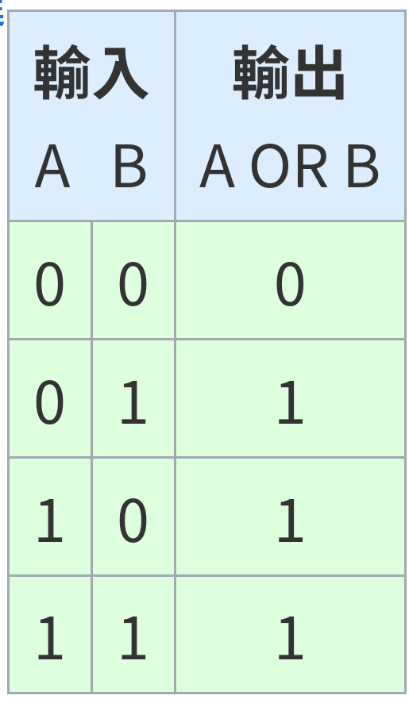

# 保有隱私與安全計算

<!-- [TOC] -->

## Introduction

* [1122_Privacy Preserving and Secure Computing](https://hackmd.io/@wycchen/1122_PPSC)

## Class 1

* Realize the technique of computation.
* [Privacy-enhancing technologies (PET)](https://en.wikipedia.org/wiki/Privacy-enhancing_technologies)
* [Quasi-identifier](https://en.wikipedia.org/wiki/Quasi-identifier)
* [k-anonymity](https://zh.wikipedia.org/zh-tw/K-%E5%8C%BF%E5%90%8D%E6%80%A7)

## Class 2

1. What is computation?
    * Take adder as an example.
    * 
2. 
3. kNN(query = (E, 7/30, 60)) -> label(Pass/Failure): use nearest k points to infer the new point.
    * There are 3 dimensions in this scenario.
   $dist_{E\rightarrow B}=\frac{\Sigma_{i=1}^3{|E_i-B_i|}}{3}$
   $dist_{E\rightarrow B}=\frac{\sqrt{(\Sigma_{i=1}^3{(E_i-B_i)^2)}}}{3}$
    * It needs to **calculate the distance** of requests in cloud compution.
4. combinational logic
    * Adder, and gate, or gate, ...
5. Turing Machine

## Class 3: Homomorphism

### Prerequisite: Proof techniques of Cryptography

#### Formal Definition

##### System Framework

TBD

##### Security Definition

$\pi$ is secure if $Pr[A\ wins] is \frac{1}{2}+negl()$ $\forall$ polynomial-time Adversary.

#### Precise Assumption

~~Your program is secure based on YOU, PROGRAMMER!!!
That is, if you're not secure, your program isn't secure.~~
* hard: if a problem can't still be solved efficiently (e.g. NP complete problem), the problem is hard.
    * $\forall$ polynomial-time solver, the probability to solve is small (negligible).
        * $negl(n)\le \frac{1}{p(n)}$, P is any polynomial function.
* secure: $\forall$ polynomial-time adversary, the probility to ~~solve the problem~~ break is negligible.
    * if an specific attribute wouldn't be violated, the crypto scheme is secure for this attribute.
* refer to [my Cryptography notes](../112-1-Cryptography/112-1-Cryptography.md)

#### Construction

1. Private Key Encryption
   enc schene $\pi=(Gen,Enc,Dec)$
    * $Gen(l) \rightarrow k$
        * $n$ is security parameter.
        * $k$ has $n$-bit.
    * $Enc(k,m) \rightarrow C$
        * m: message
        * C: ciphertext
    * $Dec(k,c) \rightarrow m$
2. Public Key Encryption
   enc schene $\pi=(Gen,Enc,Dec)$
    * $Gen(l) \rightarrow pk,sk$
        * $n$ is security parameter.
        * $k$ has $n$-bit.
    * $Enc(pk,m) \rightarrow C$
        * m: message
        * C: ciphertext
    * $Dec(sk,c) \rightarrow m$

## Class 3

1. [Homomorphism](https://zh.wikipedia.org/zh-tw/%E5%90%8C%E6%80%81)
   
   $E(a) = [a]$
   $D([a]) = a$
2. additive homomorphic encryption
    * Construction
        * $Gen(l) \rightarrow k$
        * $Enc(k,m) \rightarrow C$
        * $Dec(k,c) \rightarrow m$
            * $m_1+m_2$
        * $AddH(c_1, c_2) \rightarrow c'$
            * e.g. $AddH (Enc(k,m_1)$, $Enc(k, m_2))\rightarrow Enc(k, m_1+m_2)$
    * Do many times: Enc(k, Enc(k, Enc(k, ...) ))
3. 
    * This encryption should support AddH
    * Hint: pk=($Enc(k, 0)$, $Enc(k, 1)$)
    * Example
        * $Gen(l) \rightarrow pk, sk$
        * $Enc(pk,m) \rightarrow c$
            * $c=Enc(k, 0) \oplus Enc(k, 0) \oplus ...$ (for m times) $\oplus Enc(k, 1) \oplus Enc(k, 1) \oplus ...$ (for r times)
        * $Dec(sk,c) = m$
        * $AddH(c1, c2) \rightarrow  c'$
    * [Paillier Encryption](https://en.wikipedia.org/wiki/Paillier_cryptosystem)
        * $Gen(l) \rightarrow pk, sk$
            * 其中，$pk=(n,g)$ 、 $sk=(\lambda,\mu)$
            * Steps
                1. Choose 2 primes: p & q
                2. Compute $n=p \cdot q$
                $\lambda = lcm(p-1, q-1)$
                3. g is random in $Z_{n^2}^*$
                4. $\mu=(L(g^{-1}$ mod  $n^2))^{-1}$ mod $n$
                    * $L(x)=\frac{x-1}{n}$
        * $Enc(pk,m) \rightarrow c$
            1. Choose $r$
                * $0 < r < n$, $gcd(r,n)=1$
            2. Compute ciphertext $Enc(pk, m) \rightarrow c=g^m \cdot r^n$ (mod $n^2$)
        * $Dec(sk,c) = m$
        * Find $AddH(c_1, c_2) \rightarrow c'$
            * given
                1. $Enc(m_1)$, $Enc(m_2)$
                2. $c_1 = Enc(m_1)=g^{m_1} \cdot {r_1}^n$ mod $n^2$
                3. $c_2 = Enc(m_2)=g^{m_2} \cdot {r_2}^n$ mod $n^2$
            * $\exists AddH(c_1=Enc(m_1), c_2=Enc(m_2)) = c_1 \cdot c_2$ mod $n^2$
            $=g^{(m_1+m_2)}(r_1 \cdot r_2)^n$
                * 其中，$gcd(r, n) = 1$
    * If no randomness in ciphertext of public key setting, ciphertext would be deterministic.
        * If ciphertext was deterministic, this scene isn't EAV-secure.
4, Quiz: use [Paillier ciphertext](https://en.wikipedia.org/wiki/Paillier_cryptosystem) expression for $Enc(1)$, $Enc(0)$ to encrypt $m=4$ **twice** with different ranomness.
    * Use Paillier to implement additive secret key encryption.
    * given $Enc(0)$, $Enc(1)$
    * My attempt
      

## Class 4

1. 
2. Requirement of **efficiency**
3. Define the security
   Quantify the security
4. Remark: In conventional encryption scheme ciphertext connot be operated
   Expection:
   
5. Given:
   $c_1=Enc(m_1, r_1)$
   *For Paillier, $c_1=g^{m_1}{r_1}^{n}$*
   $c_2=Enc(m_2, r_2)$
   *For Paillier, $c_2=g^{m_2}{r_2}^{n}$*
    * Expected Result: $m_1+m_2$
    * Actual operation:  $Eval(+, c_1, c_2) \Rightarrow c' = Enc(m_1+m_2, r')$
      *For Paillier, ${c_1}\cdot{c_2}=g^{m_1}{r_1}^{n} \cdot g^{m_2}{r_2}^{n}=g^{m_1+m_2}{(r_1r_2)}^{n}=g^{m_1+m_2}r^{n}$*
6. $c'=t \cdot Enc(m, r)$
    * t is a plaintext value
   For Paillier, $c'=t \cdot Enc(m, r)={(g^m \cdot r^n)^t}=g^{mt} \cdot r^{nt}$

### Security Comparison under Additive HE


* $\begin{cases}if\ SC\ is\ 0,\ d \ge q \\
   if\ SC\ is\ 1,\ d \lt q\end{cases}$
* key idea
    * $Z=z^\beta+(d-q)$
    * 其中, $d, q \lt 2^\beta$
* $\begin{cases}if\ d \ge q,\ Z \ge 2^\beta \\
   if\ d \lt q,\ Z \lt 2^\beta \end{cases}$

* **Symbol**
    * ⊕⊖: operation over ciphertext
    * []: ciphertext
    * $c_1⊕c_2=Enc(m_1+m_2)$
    * $c_1⊖c_2=Enc(m_1-m_2)$
    * $[x]=Enc(x)$


1. User: $[q]=Enc(q)$
2. Cloud: $[Z]=[2^\beta+(q-d)]=[2^\beta]⊕[q]⊖[d]$
3. Cloud: choose a random r
   $[Z']=[Z+r]=[Z]⊕[r]$
4. Cloud -> User: $[Z']=[Z+r]$
5. User -> Cloud: $[Z'']=[Z'\ mod\ 2^\beta]=[(Z+r)\ mod\ 2^\beta]$
    * 只有知道plaintext才能做mod
6. Cloud -> User: $[(Z\ mod\ 2^\beta) \cdot 2^\beta]=[Z]⊖([Z'']⊖[r_L])$
7. User: $Dec([(Z\ mod\ 2^\beta) \cdot 2^\beta])=(Z\ mod\ 2^\beta) \cdot 2^\beta$
   $\Rightarrow d \ge q$ iff $(Z\ mod\ 2^\beta) \cdot 2^\beta \gt 0$

## Class 5

### Secure Comparison (ver 2)

* $l \equiv 2^\beta$
* $[Z]=[q]⊖[d]⊕[l]$
  $[s]=r[Z]⊕[r']$


1. Cloud -> User: $[d], d \in Z_p$ is the message size for encryption
2. choose $r, r' \in Zp$, where $2lr+r'\le|Zp|=p$, and $l > g, d$
3. User -> Cloud: $[s=Zr+r']$, $[h=lr+r']$
    * ($Z=g-d+l$)
4. Cloud -> Cloud: if $s > h$, then $q > d$

#### Why 2 nonces, r & r'?

* If there isn't $r$,
    * $s=Z+r'=l+q-d+r'$
    * $h=l+r'$
* Cloud has known $l$ & $d$, because **there are 2 equations and 2 variables, and that is, the server can know r'**.

#### Why 2lr'?

* $2lr+r'\le|Zp|=p$
* $\Rightarrow r<=\frac{p-r'}{2l}$
* 考慮$r'$可能是負數，l需要2倍才可以cover $p-r'$的範圍'


### Secure Comp

$SecureComp(input\ of\ U, input\ of\ C)\rightarrow(output\ of\ U, output\ of\ C)$

1. Input $U$: $q$
2. Input $C$: $d$
3. Output $U$: ${0, 1}$: $1\ if\ q >ｄ$
4. Output $C$: ${0, 1}$

### Privacy - Preserving k-NN


* data: $d_1,\ ...,\ d_n$ with same label
    * n: # of attributes
* $\Delta_{q \rightarrow d} = |q_1-d_1| + |q_2 - d_2| + ...+|q_n - d_n|$
    * How to caculate $|q_i-d_i|$?
        1. $SecureComp(q_i, d_i)$
        2. If $q_i \gt d_i,\ |q_i-d_i|=q_i-d_i$
           If $q_i \le d_i,\ |q_i-d_i|=d_i-q_i$

### Construction

* U: q
* C: $d^{(l)}, ..., d^{(s)}$


1. $\forall i, SecureComp(q_i, d_i^{(j)})$
2. $\forall i, [\Delta_i]=[q_i] ⊖ [d_i^{(j)}]\ if\ SC(q_i, d_i^{(j)})=1$
   or $[\Delta_i]=[d_i^{(j)}] ⊖ [q_i]\ if\ not$
3. $[\Delta^{(j)}]=⊕_1^n [\Delta_i]$
4. $SecureComp([\Delta^{(j)}], [\Delta^{(j')}])$
   Find the closest k neighbors
    * e.g. sorting algorithm

#### A Small Trick for kNN


1. How to enter the target group.
   A: Query is compared with leaders at first.
   
   $total\ \frac{n}{k} groups$
   $|small\ group| > k$
2. Compares all leaders
   $O(\frac{n}{k})=O(n)$ How to reduce?
    * Solution: Build a decision tree
      $O(log(n)+k')$
      
    * Node of DT: attribute, threshold
      
    * If $query[Attribute] > Threshlod$
        * go right

## Class 6

* [後量子密碼學](https://zh.wikipedia.org/zh-tw/%E5%90%8E%E9%87%8F%E5%AD%90%E5%AF%86%E7%A0%81%E5%AD%A6) (PQC)
    * NIST計畫徵求[後量子](https://zh.wikipedia.org/zh-tw/%E5%90%8E%E9%87%8F%E5%AD%90%E5%AF%86%E7%A0%81%E5%AD%A6)安全的演算法
        * 規範密碼學演算法的機構: [NIST](https://www.nist.gov/)
    * 後量子密碼學的研究中，有一個branch是[格密碼學](https://en.wikipedia.org/wiki/Lattice_problem)
* [格密碼學](https://en.wikipedia.org/wiki/Lattice_problem)
    * 應用[LWE問題](https://zh.wikipedia.org/zh-tw/%E5%AE%B9%E9%94%99%E5%AD%A6%E4%B9%A0%E9%97%AE%E9%A2%98)
    * ref. [Quantum Computation and Lattice Problems](https://arxiv.org/abs/cs/0304005)
* [全同態加密 (Fully homomorphic encryption)](https://zh.wikipedia.org/zh-tw/%E5%90%8C%E6%80%81%E5%8A%A0%E5%AF%86)
    * Today's goal: use [LWE](https://zh.wikipedia.org/zh-tw/%E5%AE%B9%E9%94%99%E5%AD%A6%E4%B9%A0%E9%97%AE%E9%A2%98) to build [FHE](https://zh.wikipedia.org/zh-tw/%E5%90%8C%E6%80%81%E5%8A%A0%E5%AF%86)
    * 可以做所有計算所需的操作(使用乘法/加法運算來達成)
    * 對於量子演算法來說，[LWE](https://zh.wikipedia.org/zh-tw/%E5%AE%B9%E9%94%99%E5%AD%A6%E4%B9%A0%E9%97%AE%E9%A2%98)仍然是後量子安全 (在PQC standard中還survives) (not so large q)
      但是[FHE](https://zh.wikipedia.org/zh-tw/%E5%90%8C%E6%80%81%E5%8A%A0%E5%AF%86)已經被證明不安全了 (underlying module q is large.)
* [全同態加密 (Fully homomorphic encryption)](https://zh.wikipedia.org/zh-tw/%E5%90%8C%E6%80%81%E5%8A%A0%E5%AF%86)
    * Background
      |          | RSA 1978 | Pillier 1998 | Gentry 2008 |
      | -------- | -------- | -------- | -------- |
      | multi     | ∞     | 0     | ∞     |
      | add     | 0     | ∞     | ∞     |
    * Construct
        * $Gen(\lambda) \rightarrow pk, sk$
        * $Enc(pk, m) \rightarrow c$
        * $Dec(sk, c) \rightarrow m$
        * $Eval(f, {c})$
            * Example 1: <font color="orange">$Eval(f, {c}) = Eval(f(t_1, t_2)) = Eval(f(t_1 + t_1 t_2))$
                * $f(x_1, x_2) = x_1 + x_1 x_2$
                * $c_1  = Enc(t_1)$
                * $c_2  = Enc(t_2)$
            * Take Pailier as an example,
                * $f(x_1, x_2) = x_1 + x_1$
                * $Eval(f, {c}) = Eval(f(t_1, t_2)) = Eval(f(t_1 + t_1))$
                * $c_1  = Enc(t_1)$
                * $c_2  = Enc(t_2)$
    * </font> [Learn-with-Error (LWE)](https://zh.wikipedia.org/zh-tw/%E5%AE%B9%E9%94%99%E5%AD%A6%E4%B9%A0%E9%97%AE%E9%A2%98)
        * hard assumption in cryptography
        * Dimension $n$, modulo $q$, B-bounded for noise.
            * noise $e \leftarrow X$: Guansian over $Z$
              $Pr[|e|>B]<negl()$
              
                * distrobution
                    * normal distrobution
                      
                    * randomness
                  
        * 全同態演算法 with Lattice Problems被證明不安全: [Quantum Algorithms for Lattice Problems](https://eprint.iacr.org/2024/555)
        * Search-LWE problem: Find $S \in Z_q^n$
        * Given
          $e_i \leftarrow X$ (常態分佈)
          $a_1 \leftarrow Z_q^n$, $b_1=<a_1, S> + e_1$
          $a_2 \leftarrow Z_q^n$, $b_2=<a_2, S>+ e_2$
          ...
          $a_m \leftarrow Z_q^n$, $b_m=<a_m, S>+ e_m$
        * $Pr[e>B] \le negl()$
        * 
    * Decision-LWE: $(b,$ <font color="red">$A$</font>$) \approx ($<font color="red">$b, A$</font>$)$
        * <font color="red">紅色參數代表裡面**有**藏資訊S</font>
        * 黑色參數代表裡面**沒有**有意義的資訊(e.g. S)

### One Bit Secret Key Encryption from LWE

* $Gen(n) \rightarrow k = S \in Z_q^n$
    * $Z=\{0,\ ...,\ q-1\}$
      $Z=\{-\frac{q}{2},\ ...,\ \frac{q}{2}-1\}$
* $Enc(k, m) \rightarrow C$
    * $m \in \{0, 1\}$
    * Step
        1. Chooise a uniform $a \in Z_q^n$
        2. output $c=(c_1, c_2)$
           $c_1=a$
           $c_2=<a, S> +e+\frac{q}{4}m$
* $Dec(k, c) \rightarrow m$
    * Step
        1. $t=c_2-<k, c_1>$
        2. If t is close to 0, m is 0.
           If t is close to $\frac{q}{4}$, m is 1.

### Example m = {0, 1, 2, 3}

* $Gen(n) \rightarrow k = S \in Z_q^n$
    * $Z=\{0,\ ...,\ q-1\}$
      $Z=\{-\frac{q}{2},\ ...,\ \frac{q}{2}-1\}$
* $Enc(k, m) \rightarrow C$
    * $m \in \{0, 1, 2, 3\}$
    * Step
        1. Chooise a uniform $a \in Z_q^n$
        2. output $c=(c_1, c_2)$
           $c_1=a$
           $c_2=<a, S> +e+\frac{q}{8}m$
* $Dec(k, c) \rightarrow m$
    * Step
        1. $t=c_2-<k, c_1>$
        2. If t is close to 0, m is 0.
           If t is close to $\frac{1}{8}q$, m is 1. 
           If t is close to $\frac{2}{8}q$, m is 2. 
           If t is close to $\frac{3}{8}q$, m is 3.
* B-bounded is $\frac{q}{16}$ in this case.
* 不能無限制的壓低B-bounded，因為常態分佈的疊加會導致誤差增加
  

### One Bit Public Key Encryption

* Gen: Choose a secret key $t=(1, s_1, s_2, ... s_n)$
    * public key is $B=[b|-A]$
      
        * $m \ge n \cdot log(q)$
    * $B \cdot t = b - sA = e$
* $Enc(B, \mu\in \{0, 1\}) \rightarrow C$
    * $C=(\mu, 0, ..., 0) \cdot \frac{q}{2} + r \cdot B$
        * $random\ r \in {\{0, 1\}}^m$
* $Dec(t, C)=m$
    * $(t, C)=\mu \cdot \frac{q}{2} + r \cdot B \cdot t$
        * 其中，$r \cdot B \cdot t = e$ is small
        * 因此可以得到$\mu \cdot \frac{q}{2} \Rightarrow \mu$

### One Bit PKE (LSB-ver)

* Gen: choose a secret key $t=(1, s_0, s_1, ... s_n$
    * public key is $B=[b|-A]$
    * $B=sA+$<font color="red">$2e$</font>
* Enc: $C=(\mu, 0, ..., 0) + 2rB$
* Dec: $(t, C)=\mu+ 2 \cdot r \cdot B \cdot t=\mu+2e$
<!-- * 因為$2e$是偶數，可以藉此直接知道$\mu$ -->
  

### ADD

* $c_1=(\mu_1, 0, ..., 0) + r_1B$
* $c_2=(\mu_2, 0, ..., 0) + r_2B$
* $c_1+c_2=(\mu_1+\mu_1, 0, ..., 0)+(r_1+r_2)B$
* Dec: Check $(t, C')$ is even or not
  If even, $\mu'=0$

| $\mu_1$ | $\mu_2$ | $\mu_1\ ADD\ \mu_2$ |
| -------- | -------- | -------- |
| 0     | 0     | 0     |
| 0     | 1     | 1     |
| 1     | 0     | 1     |
| 1     | 1     | 0     |

## Class 7

* Homomorphic operation $\rightarrow$ large q
  
* The quantum computation will break the cases of large q, but little q would just keep safe.

### Multiple

* [tensor product](https://zh.wikipedia.org/zh-tw/%E5%BC%A0%E9%87%8F%E7%A7%AF)

* 2 vectors
    1. $(1, 2, 3, 4)$
    2. $(0, 1, 0, 1)$
* tensor product of the 2 vectors:
  ```
  0 1 0 1
  0 2 0 2
  0 3 0 3
  0 4 0 4
  ```
* How to multiple $C_{m^2}$ and $C_m$?
    1. ~~Increase the dimension of $C_m$ to $m^2$ dimension: 乘上單位矩陣$I$~~
       每次做multiple運算都提高維度，成本過高
    2. Decrease $m^2$ dimension into $m$ dimension: relinear

### KeySwitch

* Input: long vector $C_{n^2-D}$ under key $T_{n^2-D}$
* Output: normal vector ciphertext $d_{n-D} \in Z_q^n$ under a new key $t'$
    * <font color="red">$t'=(1, -s'-)$</font>
    * <font color="red">Hope: $(d, t')=\mu +$ small even</font>
        * <font color="red">$(C, T)=\mu +$ small even</font>

#### Proprocessing

* $KeySwitchGen(T, t')\rightarrow{\{h_i\}}^{n^2}_{i=1}$
    * s.t. $(h_i, t')=T_i+$ small even
        * $h_i$是一個$n^2 \cdot n$的矩陣
        * T: $n^2$-D
    * 透過高斯消去法，可取得$h_i$
* Put $\{h_i\}$ in the public key

#### Switch Key

1. set $d=\Sigma_iC_ih_i$
    * $C_i$ is $n^2$-dimension
    * $h_i$ is a $n^2 \cdot n$
    * $d$ is $n$-dimension
2. $(d, t')=\Sigma_iC_i(T_i+small\ even)$
   $=(C, T)+$<font color="red">$\Sigma_iC_i \cdot small\ even$</font>
   $=\mu+$<font color="red">$small\ even$</font>
    * <font color="red">red part is not small</font> because it small even multiple with the ciphertext.
3. How to reduce the large <font color="red">$\Sigma_iC_i \cdot small\ even$</font>?
    * $15={(1111)}_2$
      $=BitComp(15) \cdot Power\_of\_2(15)$
      $={(1111)}_2 \cdot (2^3, 2^2, 2^1, 2^0)=15$
      
      $\Rightarrow 15\cdot3=BitDecomp(15) \cdot Power\_of\_2(3)$
      $=((1,1,1,1)\cdot(3\cdot2^3, 3\cdot2^2, 3\cdot2^1, 3\cdot2^0))$
      $=3\cdot2^3+3\cdot2^2+3\cdot2^1+3\cdot2^0)=45$
    * $(d, t')=(C, T)+$<font color="red">$\Sigma_iC_i \cdot small\ even$</font>
      $=(C, T)+$<font color="red">$Power\_of\_2(C_i) \cdot BitDecomp(small\ even)$</font>
        * Purpose: To decouple $C_i$ & small even
        * 因為Power_of_2會遠大於BitDecomp，因此把ciphertext$C_i$放在Power_of_2上

#### Issue of KeySwitch

1. $t'$ is not the original $t$
   Ans: Switch Key from $t'$ to $t$
2. There exists $k$ s.t. $k \cdot e \gt threshold$
   $\Rightarrow$ 導致結果出錯
   $\therefore$ 需要減少誤差
   $\Rightarrow$ Discuss it in the next part: Bootstraping

### Bootstrapping

* [Bootstrapping](https://zh.wikipedia.org/zh-tw/%E8%87%AA%E5%8A%A9%E6%B3%95)
    * $C^*$: sort of error close to threshold.
    * $Eval(Dec(., C^*), Enc(sk))=Enc(m)$
      $\Rightarrow C^*=Enc(sk)$
        * $Enc(sk)$: 用sk加密sk
    * P.S. 由於$Eval()$操作的結果只能輸出密文，因此$Eval(Dec(Enc(sk), Enc(sk)))$後還是只能得到$Enc(sk)$


## Class 8

### Garbled Circuits

* circuit $\leftarrow$ gates
    * Adder
      
    * OR gate
      
    * XOR gate
      
* Syntax of [Garbled circuit](https://en.wikipedia.org/wiki/Garbled_circuit)
    * $GarbledC(n, C) \rightarrow \widetilde{C}, k$
        * $n$ is a security parameter
        * $C$ is a circuit
        * $\widetilde{C}$ is a garbled circuit
        * k is a key
    * $GarldedI(k, x) \rightarrow \widetilde{x}$
        * x is the input
        * $\widetilde{x}$ is garbled input.
    * $Eval(\tilde{C}, \widetilde{x}), C(x)$
        * $C(x)$ is output.
* Take the OR gate as an example.
    * $W_0^{(1)}$: $0$ 代表value, $(1)$代表是第一個input
      
    * Wires of the gate includes $Inp1$, $Inp2$, and $output$.


#### Security

* The server only knows the output $C(x)$.
* The [permutation](https://zh.wikipedia.org/zh-tw/%E6%8E%92%E5%88%97) step helps to avoid that the server learns the rules.

#### Exercise: NOT gate

| Inp1 | Inp2 | Output |
| -------- | -------- | -------- |
| $Ⱳ_0^{(1)}$     | $Ⱳ_0^{(2)}$     | $Ⱳ_1^{(3)}$     |
| $Ⱳ_0^{(1)}$     | $Ⱳ_1^{(2)}$     | $Ⱳ_1^{(3)}$     |
| $Ⱳ_1^{(1)}$     | $Ⱳ_0^{(2)}$     | $Ⱳ_0^{(3)}$     |
| $Ⱳ_1^{(1)}$     | $Ⱳ_1^{(2)}$     | $Ⱳ_0^{(3)}$     |


#### $GarbledC(n, C) \rightarrow \widetilde{C}, k$

| Inp1 | Inp2 | Output |
| -------- | -------- | -------- |
| $Ⱳ_0^{(1)}$     | $Ⱳ_0^{(2)}$     | $Ⱳ_0^{(3)}$     |
| $Ⱳ_0^{(1)}$     | $Ⱳ_1^{(2)}$     | $Ⱳ_1^{(3)}$     |
| $Ⱳ_1^{(1)}$     | $Ⱳ_0^{(2)}$     | $Ⱳ_10^{(3)}$     |
| $Ⱳ_1^{(1)}$     | $Ⱳ_1^{(2)}$     | $Ⱳ_1^{(3)}$     |

$\Rightarrow \widetilde{C} =$
* $Enc^{Ⱳ_0^{(1)}}(Enc_{Ⱳ_0^{(1)}}(Ⱳ_0^{3}))$
* $Enc^{Ⱳ_0^{(1)}}(Enc_{Ⱳ_1^{(1)}}(Ⱳ_1^{3}))$
* $Enc^{Ⱳ_1^{(1)}}(Enc_{Ⱳ_0^{(1)}}(Ⱳ_1^{3}))$
* $Enc^{Ⱳ_1^{(1)}}(Enc_{Ⱳ_1^{(1)}}(Ⱳ_1^{3}))$


$\Rightarrow k = \{W_b^{(i)}\}$

##### Step

1. Generate a circuit.
2. Generate key & [permutation](https://zh.wikipedia.org/zh-tw/%E6%8E%92%E5%88%97)

### $GarbledI(k, x) \rightarrow \widetilde{x}$

$GarbledI(k, x) \rightarrow \widetilde{x}$
    * $k=\{Ⱳ\}$
    * $x={0, 1}_b$
    * $\widetilde{x}=Ⱳ_0^{(1)}, Ⱳ_1^{(2)}$
    
### $Eval(\widetilde{C}, \widetilde{x}) \rightarrow C(x)$

$Eval(\widetilde{C}, \widetilde{x}) \rightarrow C(x)$
$\because Enc^{Ⱳ_0^{(1)}}(Enc_{Ⱳ_1^{(1)}}(Ⱳ_1^{3}))$
$\therefore C(x)=Dec_{Ⱳ_1^{(2)}}(Dec_{Ⱳ_0^{(1)}}(C_{{01}_b}))=Ⱳ_1^{(3)}$

## Class 9

### Scenario of GC


* ML model轉化成C (garbled circuit)
    * 由於C有經過混淆處理後才傳給Cloud，因此Cloud無法學到任何C的資訊
* 一魚兩吃，同時保證了安全計算、同時create了一個ML model

### Garbled Circuit can only be used for **ONE TIME**

* 若Cloud decrypts了愈多row，它對於這個circuit的理解愈多，愈有可能有辦法推測出circuit的真實內容

### Garlded Circuit


$Ⱳ_0^{(1)}, Ⱳ_0^{(2)}, Ⱳ_0^{(3)}, Ⱳ_0^{(4)}, Ⱳ_0^{(5)}, Ⱳ_0^{(6)}, Ⱳ_0^{(7)}$
...
$Ⱳ_1^{(1)}, Ⱳ_1^{(2)}, Ⱳ_1^{(3)}, Ⱳ_1^{(4)}, Ⱳ_1^{(5)}, Ⱳ_1^{(6)}, Ⱳ_1^{(7)}$

#### GarldedC(n, C): 列出Truth Table


1.AND Gate 1 2

| Inp1 | Inp2 | Output 5 |
| -------- | -------- | -------- |
| $Ⱳ_0^{(1)}$     | $Ⱳ_0^{(2)}$     | $Ⱳ_0^{(5)}$     |
| $Ⱳ_0^{(1)}$     | $Ⱳ_1^{(2)}$     | $Ⱳ_0^{(5)}$     |
| $Ⱳ_1^{(1)}$     | $Ⱳ_0^{(2)}$     | $Ⱳ_0^{(5)}$     |
| $Ⱳ_1^{(1)}$     | $Ⱳ_1^{(2)}$     | $Ⱳ_1^{(5)}$     |

2.OR Gate 3 4

| Inp3 | Inp4 | Output 6 |
| -------- | -------- | -------- |
| $Ⱳ_0^{(3)}$     | $Ⱳ_0^{(4)}$     | $Ⱳ_0^{(6)}$     |
| $Ⱳ_0^{(3)}$     | $Ⱳ_1^{(4)}$     | $Ⱳ_1^{(6)}$     |
| $Ⱳ_1^{(3)}$     | $Ⱳ_0^{(4)}$     | $Ⱳ_1^{(6)}$     |
| $Ⱳ_1^{(3)}$     | $Ⱳ_1^{(4)}$     | $Ⱳ_1^{(6)}$     |

3.AND Gate 5 6

| Inp5 | Inp6 | Output7 |
| -------- | -------- | -------- |
| $Ⱳ_0^{(5)}$     | $Ⱳ_0^{(6)}$     | $Ⱳ_0^{(7)}$     |
| $Ⱳ_0^{(5)}$     | $Ⱳ_1^{(6)}$     | $Ⱳ_0^{(7)}$     |
| $Ⱳ_1^{(5)}$     | $Ⱳ_0^{(6)}$     | $Ⱳ_0^{(7)}$     |
| $Ⱳ_1^{(5)}$     | $Ⱳ_1^{(6)}$     | $Ⱳ_1^{(7)}$     |

#### GarbledI: 以上述範例來說，input 1~4是key (整個系統的input)

$Ⱳ_0^{(1)}, Ⱳ_0^{(2)}, Ⱳ_0^{(3)}, Ⱳ_0^{(4)}$
...
$Ⱳ_1^{(1)}, Ⱳ_1^{(2)}, Ⱳ_1^{(3)}, Ⱳ_1^{(4)}$

若選擇input=0010, 則$\widetilde{x}={Ⱳ_0^{(1)}}{Ⱳ_0^{(2)}}{Ⱳ_1^{(3)}}{Ⱳ_0^{(4)}}$

#### Eval

(TODO: TB)

### Summary

* input-output only: $2^4=16$ rows
* truth table version (total gate input): ${2^2}*3=12$

### Use more gates

* input-output only: $2^8=256$ rows
* truth table version (total gate input): ${2^2}*7=28$

### Security (Intuition) of GC

* Erase the unnecessary message
* 例如沒用的output


* GC **includes** information of input-output wires (blud one)
* But we needs another version with **no information** of input-output wires (red one)

#### 

* 因為這個範例選擇了 $Ⱳ_1^{(1)}$   $Ⱳ_1^{(2)}$ $Ⱳ_1^{(5)}$ 這一row作為input，因此 $Ⱳ_1^{(5)}$ 的資訊不能被erased

| Inp1 | Inp2 | Output 5 |
| -------- | -------- | -------- |
| $Ⱳ_0^{(1)}$     | $Ⱳ_0^{(2)}$     | $\widehat{Ⱳ_0^{(5)}}$   |
| $Ⱳ_0^{(1)}$     | $Ⱳ_1^{(2)}$     | $\widehat{Ⱳ_0^{(5)}}$     |
| $Ⱳ_1^{(1)}$     | $Ⱳ_0^{(2)}$     | $\widehat{Ⱳ_0^{(5)}}$     |
| 這一row不能被erase$\rightarrow$ $Ⱳ_1^{(1)}$     | $Ⱳ_1^{(2)}$     | $Ⱳ_1^{(5)}$     |

### Small Project (Today)

* ML model: kNN
    * k is 2
* 5 data: $|Data|=5$
    * Data: 1 value 5 bit per data (0~31)
    * 1 dimension
    * $1 \cdot 5$

#### Draw the gates

1. 
2. 針對其他4個data來比較distance: $4 \cdot$ Distance
3. 對4個距離做排序，透過bubble sort、使用$4 \cdot 3 = 12$個比較器做排序
4. 取最小距離的另外2個data作為結果

## Class 10: Oblivous RAM

* Turing machine v.s. RAM
    * Turing Machine: locate the target by move 1 for once time
    * RAM: locate the target by just move to it's pointer.
* Protect Data Privact of Cloud Computing
    * Encryption
        * Public key encryption
    * Cloud Server's Adversary knows the frequency user access each files.
        * access more frequently $\Rightarrow$ more importantly
        * Access transcript Although encryption provides data privacy, adversary still knows the access history.
        * Take **binary search tree** as an example, the **ROOT node** can be confidently **inferred** by Adversary by the **access history**.
    * AccessData(location, value, R/W)
        * AccessData(100, 20, W)
        * AccessData(150, 1, R)
    * Take the above AccessData as an example,
        * we can use encryption to hide the information of value.
        * we can combine R & W into a simple pair of operations，一次執行一對operations以隱藏user是在執行R / W

### Illustration

* [ORAM algorithm](https://en.wikipedia.org/wiki/Oblivious_RAM)
* Trivial Solution
    * Access所有phyical memory cells per logical memory access.
    * Time overhead: O(n)
    * Space overhead: O(1)
    * Cache size: O(1)
    * Security: statistical vs. computational

### Tree-base ORAM framework

* $ORead(block\ i)$
* $OWrite(block\ i, value)$
* $Flush()$

### Security Intuition

1. Consider twice read to the same location

### Complexity

* Time overhead: $\omega(log^2(n))$
* Space overhead: $\omega(log(n))$
* Cache size: $O(\Omega(n))$


### Bootstrapping

* $O(2n(log(n)))$
* $\Rightarrow O(n(log(n)))$
* $\Rightarrow ...$
* $\Rightarrow O(1)$

### Final Version

#### Complexity

* Time overhead $\omega(log^3(n))$
* Space overhead $\omega(log^2(n))$

## Class 11

### Update: Hide the path

* Problem: Adversary can know the along path from root to $Pos[i]$
* Solution: 把$pos[loc]$移動至root
  

### Flush

* If bucket size $L=\omega(log(n))$, then $Pr[overflow] \lt negl(n)$
* Problem: 
  $\because$ [Update: Hide the path的solution](#Update-Hide-the-path)會把資料塞到root bucket中
  $\therefore$ 會導致root bucket容易overflow
* Solution: 把root bucket中的內容移動至intersection
  
    1. Random pick a path k
    2. open
    3. get loc
    4. Check pos[loc]
    5. Put the block to the intersection node of path k and path pos[loc]

#### Compexity

* Time overhead: $\omega(log^2(n))$
    * Visit 2 paths, length $O(log(n))$
    * Bucket Size: $L=\omega(log(n))$
* Space overhead $\omega(log(n))$
    * $(2n-1)\omega(log(n))/n$
* Catch size: $\Omega(n)
    * Pos map size=$n/O(1) \lt n$

### Bootstrapping


#### Compexity

* Time overhead: $\omega(log^3(n))$
    * Visit 2 paths, length $O(log(n))$
    * Bucket Size: $L=\omega(log(n))$
    * Recursion level: $O(log(n))$
* Space overhead $\omega(log(n))$
* Pos map size $O(1)$ after bootstrapping
* Catch size: $O(log^2(n))=O(log(n)) \cdot O(log(n))$
    * Bucket Size: $O(log(n))$
    * A path contains $O(log(n))$ nodes

### Search


#### Complexity

* Time overhead: $\omega(log^2(n))$
    * Visit 2 paths, length $O(log(n))$
    * Bucket Size: $L=\omega(log(n))$
    * ~~Recursion level: $O(log(n))$~~
* Space overhead $\omega(log(n))$
* Pos map size $O(1)$ ~~after bootstrapping~~
* Catch size: $O(log^2(n))=O(log(n)) \cdot O(log(n))$
    * Bucket Size: $O(log(n))$
    * A path contains $O(log(n))$ nodes

### Delegation the computation into cloud

* With homomorphic encryption, it's available to delegate the computation into cloud.

### Universal Circuit

* $F(x)=U(\widetilde{F_1}, x)$
* 就像是把[ALU](https://zh.wikipedia.org/zh-tw/%E7%AE%97%E8%A1%93%E9%82%8F%E8%BC%AF%E5%96%AE%E5%85%83)做成circuit以支援FHE-based ORAM


## Class 12

### Secret Sharing


#### 3 out of 3

* 3個shares可以合作共同recover secret

#### 2 out of 3

* 任意2個shares可以合作共同recover secret

#### Approach

##### 3 out of 3

* Goal: 3 out of 3
* Given: secret=3
* Solution: 3-party各有一個point，可以藉此產生1元2次方程式 (需要3 points來還原方程式)
  

##### 2 out of 3

* Goal: 2 out of 3
* Given: secret=3
* Solution: 3-party各有一個point，可以藉此產生1元1次方程式 (需要2 points來還原方程式)
  

##### Example: 2 out of 5

* y = ax + 4
    * Given secret=4
    * e.g.
        1. (1, 6)
        2. (3, 10)
        3. (10, 24)
        4. (15, 34)
        5. (21, 46)
    * $\Rightarrow a=2$

##### t out of n

* Goal: t out of n
    * $f(x)=\sum\limits_{i=0}^{t-1} a_ix^i \in F$
    * t: threshold, must be prime
    * $\Rightarrow$ degree t-1 poly
    * $F \in Z_g$
    * $|F|>n$

#### Add


* Goal: Support add operation
* Given $n=11$ (mod 11)
* Solution Add $\Rightarrow$ secret + n
    * **記得要MOD**
* Take $+2$ as an example, $(1, 6) \& (2, 8) \Rightarrow y=2x+$ <font color=red> $4$ </font>
  +2
  $\Rightarrow (1, 8) \& (2, 10) \Rightarrow y=2x+$ <font color=red>$6$</font>

#### Multiply


* Goal: Support multiply operation
* Given $n=11$ ( $mod\ 11$ )
* Solution: (詳見example)
    * **記得要MOD**
* Take $\times2$ as an example,
    1. $(1, 6) \& (2, 8) \Rightarrow y=$ <font color=red> $2x+4$ </font>
    2. $\times 2 \Rightarrow (1, 12) \& (2, 16) \Rightarrow y=$<font color=red>$4x+8$</font>
    3. MOD $\Rightarrow (1, 1) \& (2, 5) \Rightarrow y=$ <font color=red>$4x-3$</font>

### HW: 做一次Quiz2的內容

* [Quiz2](https://hackmd.io/0lEOGXtEQ3-GlxcU5VOFEA?view#1122_PPSC-Quiz-2)
    1. [ ] 做一次Quiz2的內容
        * 2. & 3.改為指出錯誤的地方，並修改題目
